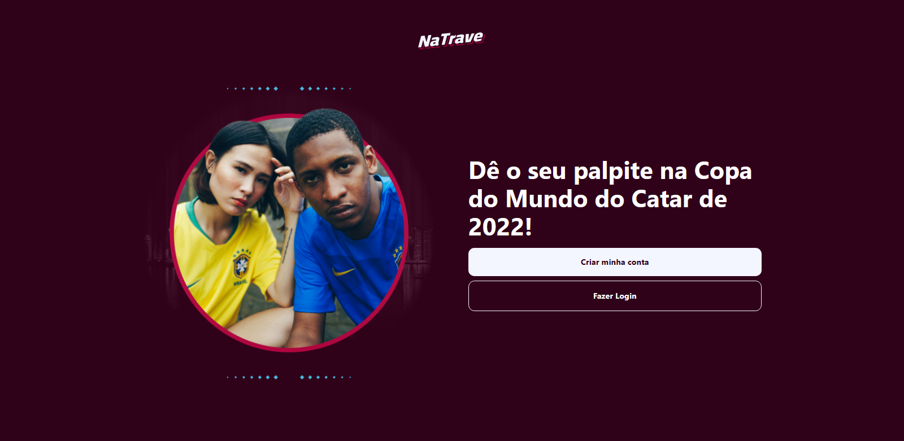
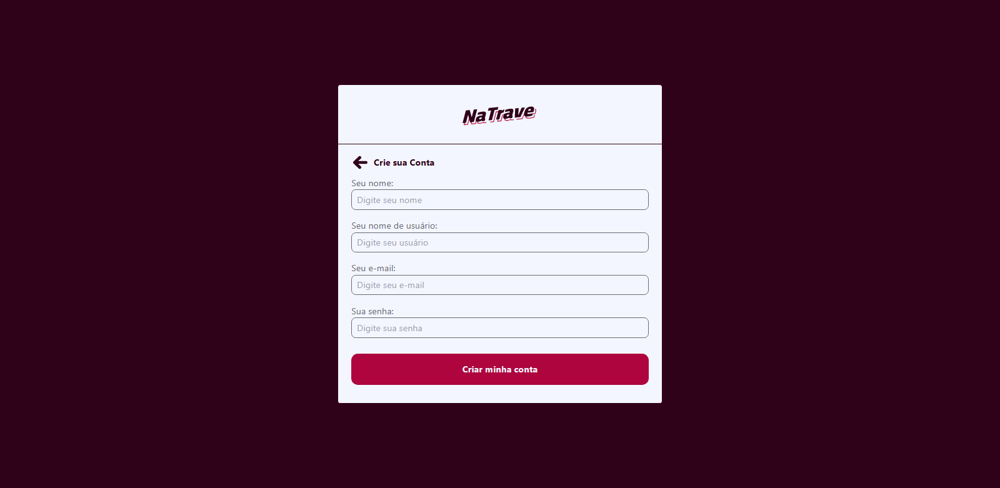
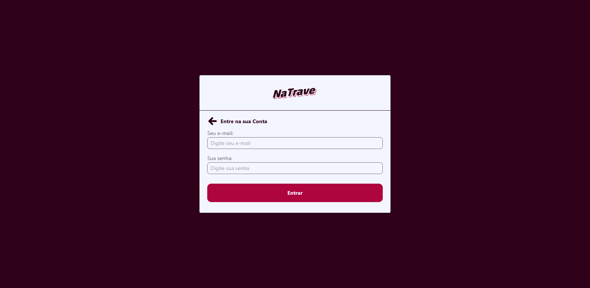
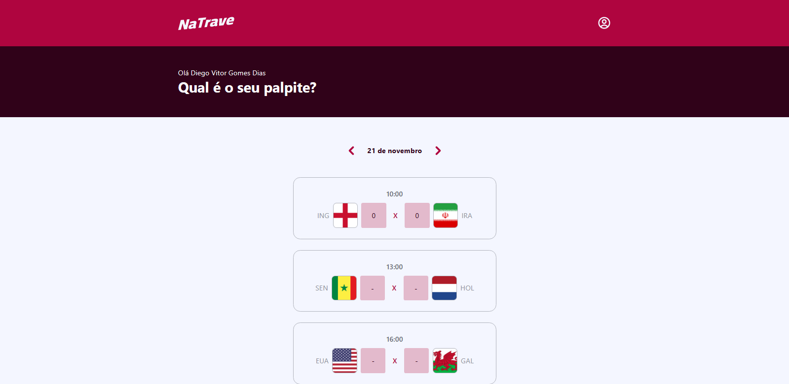
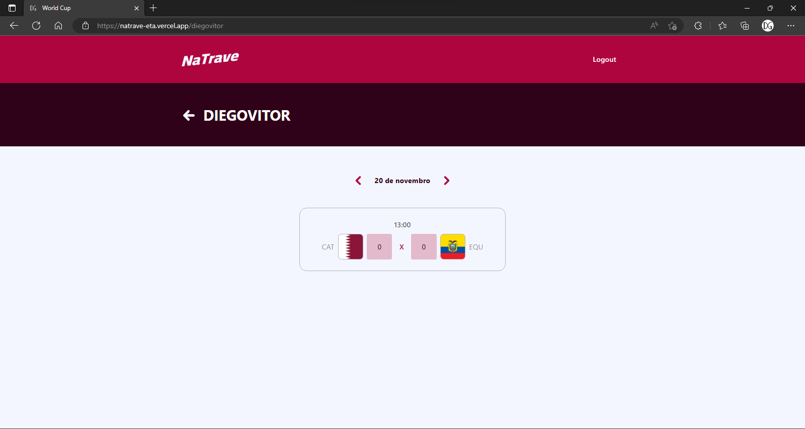

# NaTrave Full Stack Challenge Web

Projeto desenvolvido para estudo durante o evento Full Stack Challenge da [Codar.me](https://codar.me/).

## Sobre 

O projeto consiste em uma aplicação de compartilhamento de palpites dos jogos da Copa do Mundo de 2022.

**Storytelling**: \
Home [(/)](https://natrave-eta.vercel.app/) => \
Login [(/login)](https://natrave-eta.vercel.app/login) ou Cadastro [(/cadastro)](https://natrave-eta.vercel.app/cadastro) => \
Dashboard [(/dashboard)](https://natrave-eta.vercel.app/dashboard) ou Palpites cadastrados de um usuário [(/:username)](https://natrave-eta.vercel.app/diegovitor).

Este projeto contém uma única página privada, na qual para acessá-la é necessário realizar o login e automaticamente vai salvar o token de acesso do usuário no localStorage.

## FrontEnd

Utilizei do Framework [Vite](https://vitejs.dev/) + [React](https://pt-br.reactjs.org/) utilizando o [TailwindCss](https://tailwindcss.com/) e outras depedências como [Yup](https://www.npmjs.com/package/yup) e [Formik](https://formik.org/).

Vale ressaltar que todo o Design System teve como principal base o projeto da [Codar.me](https://codar.me/) com leves alterações.

O projeto serviu principalmente para reforçar meu entendimento sobre requisições, react-uses e responsividade.
Neste projeto que aprendi a utilizar efetivamente o [Yup](https://www.npmjs.com/package/yup) e [Formik](https://formik.org/) na construção de formulários e principalmente a realizar logins, logouts, validação do token de acesso e rotas dinâmicas.

A conexão com a API foi feita utilizando o [Axios](https://axios-http.com/ptbr/).

obs. O projeto em si está funcional e "finalizado", entretanto não existe nada no mundo que não possa ser melhorado.\
Observando este projeto um tempo apôs o deploy, estando mais experiente e tendo absorvido mais conhecimento sobre SOLID e estruturação, percebi que poderia ter organizado os arquivos e funções de outra forma.

## Images

**Home**

**Register**

**Login**

**Dashboard**

**User View**
